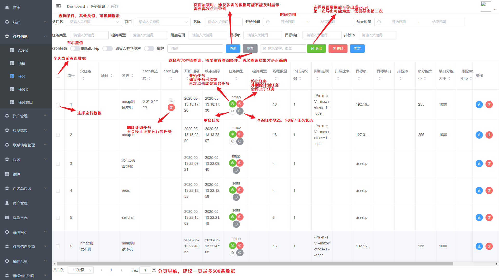
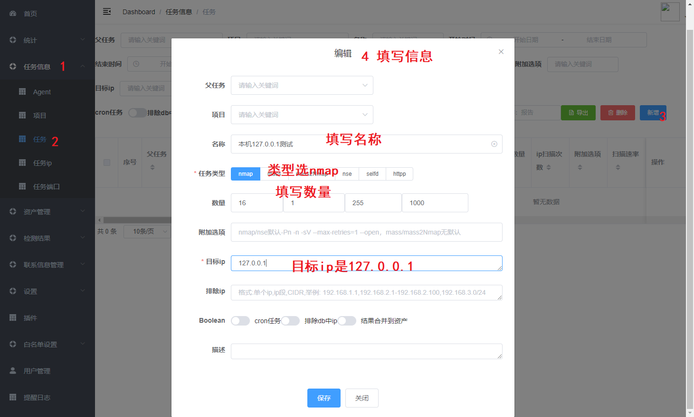
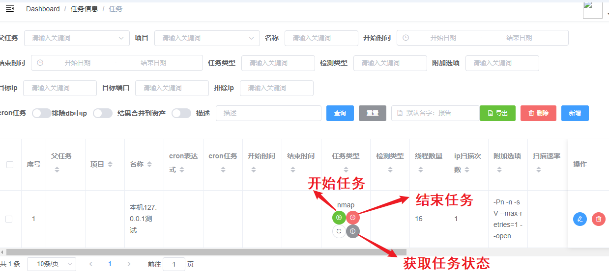
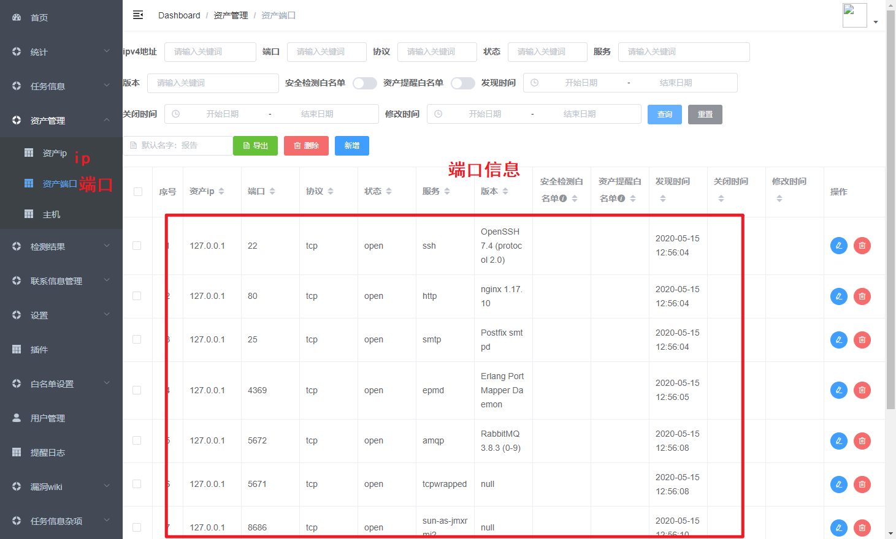
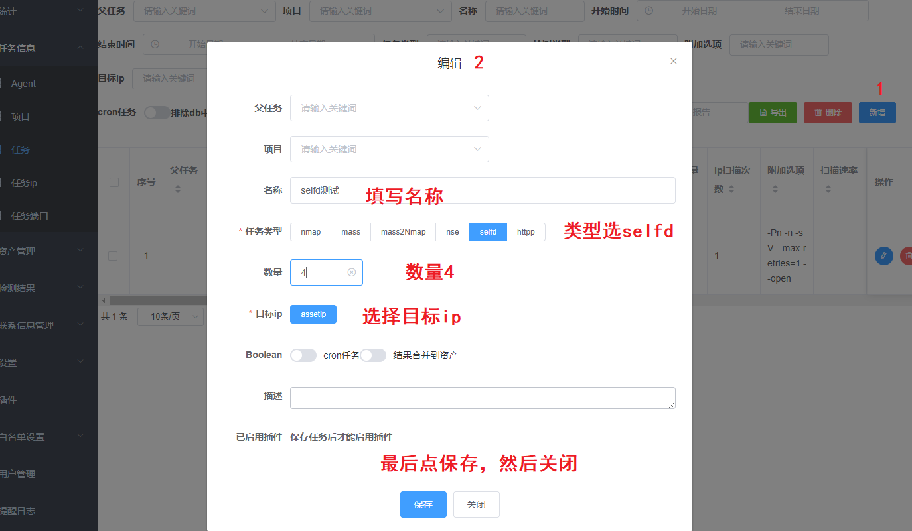
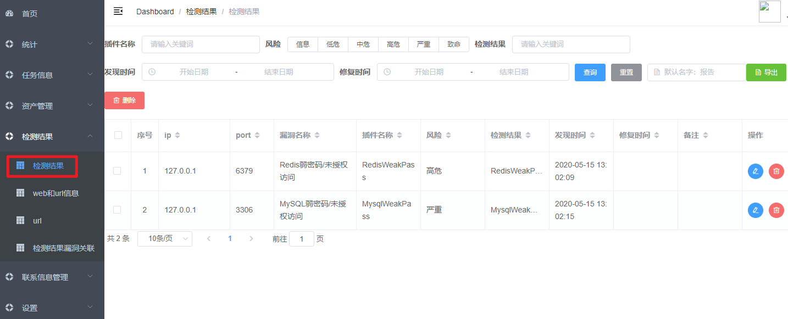
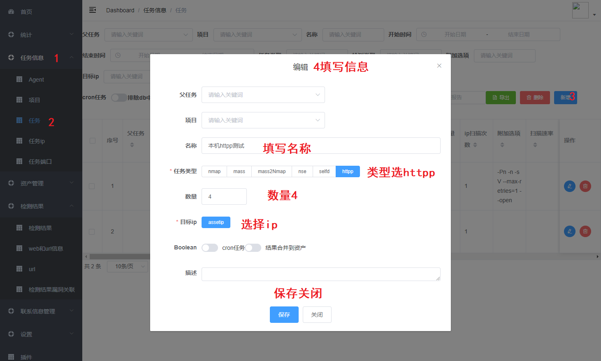
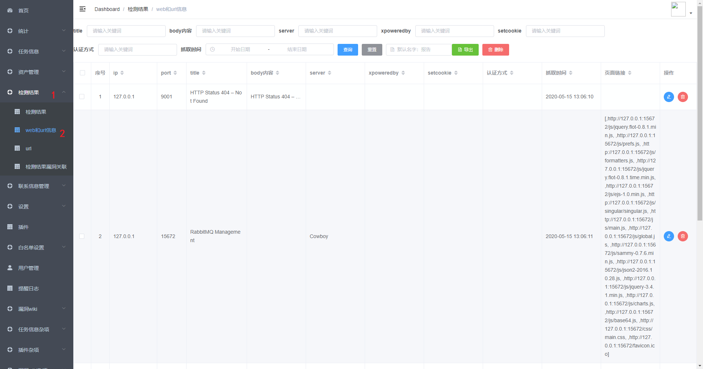

# 魔方-MagiCude-快速上手指南

by [贰拾壹](https://github.com/er10yi )

赋予数据无限可能：分布式端口扫描、资产安全管理、实时威胁监控与通知、高效漏洞闭环、漏洞wiki、邮件报告通知、poc框架，and more!

## 登录

访问服务器ip并登录，当前是http://192.168.12.128/

```
账号：MagiCude
密码：见newPass.txt
```

## 基本功能

以**任务信息-任务**为例，页面查询等操作



## 钉钉机器人推送


当前采用的是钉钉机器人群消息推送，由于发送频率限制，每条消息发送前休眠7秒

1. 新建钉钉群
2. 在桌面端钉钉，打开群设置，并新增自定义机器人（通过Webhook接入自定义服务）
3. 机器人名字随意填写，安全设置选 **加签**，密钥复制到前端**设置-通知设置-IM通知-秘钥**处
4. Webhook 地址复制到前端**设置-通知设置-IM通知-消息地址**处

配置成功后，需要开启通知才能推送漏洞消息，并且只有在风险等级里的风险才会提醒

## 任务及结果说明

```
各个任务，扫描后结果的具体位置
nmap/mass/mass2Nmap -> 资产管理-资产ip/资产端口/主机
selfd/nse -> 检测结果-检测结果
httpp -> 检测结果-web信息/web和url信息/url
```

1. 支持nmap、mass、mass2Nmap、nse、selfd、httpp六种任务类型

   | 任务类型  | 说明                                                         |
   | --------- | ------------------------------------------------------------ |
   | nmap      | 调用nmap执行端口扫描，支持udp协议端口入库；结果包含ip、端口、协议、状态、服务、版本等信息 |
   | mass      | 调用masscan执行端口扫描；结果包含ip、端口、协议、状态等信息  |
   | mass2Nmap | 先调用masscan执行端口扫描，再调用nmap对masscan扫描的结果进行端口详细信息扫描；结果包含ip、端口、协议、状态、服务、版本等信息 |
   | nse       | 调用nmap的nse插件进行安全检测，前端可以配置nse插件；结果包含ip端口、漏洞名称、插件名称、风险、检测结果等信息 |
   | selfd     | 调用自定义插件进行安全检测；结果包含ip端口、漏洞名称、插件名称、风险、检测结果等信息 |
   | httpp     | 对：like http、为空、null、tcpwrapped、unknown、包含?的端口服务和版本，进行http页面爬取（非JS动态页面）；结果包含ip端口，web title，body内容，http头的server、xpoweredby、setcookie、认证方式，页面所有链接等信息 |

2. 支持nse、selfd、httpp三种指定任务的检测类型

   | 检测类型 | 说明                                                         |
   | -------- | ------------------------------------------------------------ |
   | nse      | nse检测任务与nse任务类似，只不过nse检测任务针对的是指定的任务 |
   | selfd    | selfd检测任务与selfd任务类似，只不过selfd检测任务针对的是指定的任务 |
   | httpp    | httpp检测任务与httpp任务类似，只不过httpp检测任务针对的是指定的任务 |


## 端口扫描任务-以nmap扫描任务为例

目标ip为服务器本机地址127.0.0.1，全端口扫描



开始任务



查看ip及端口



## 插件扫描任务-以selfd任务为例

需要等nmap任务扫描完成后

新建



开始任务，同nmap任务一样操作

如果配置了钉钉群推送，漏洞信息会实时推送到群里

查看扫描结果



## httpp任务

需要等nmap任务扫描完成后

新建



开始任务，同nmap任务一样操作

查看扫描结果



## 邮件资产报告/漏洞报告

1. 增加邮件配置

   前端**设置-通知设置-邮件通知-邮箱host**，填写host

   前端**设置-通知设置-邮件通知-账号**，填写账号

   前端**设置-通知设置-邮件通知-密码/授权码**，填写密码/授权码

   前端**设置-通知设置-邮件通知-提醒邮箱列表**，填写提醒邮箱列表

2. 修改定时任务

   前端**设置-定时任务-邮件资产报告**，增加邮件资产报告的cron表达式

   前端**设置-定时任务-邮件漏洞报告**，增加邮件漏洞报告的cron表达式

3. 之后等任务时间触发即可
